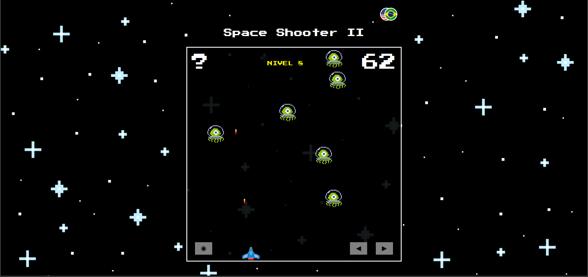

# Space-Shooter
- Eu não sou o criador original desse jogo, mas como gostei muito do projeto, resolvi fazer um fork para modificar e experimentar minha "própria" versão.
- Foi e ainda esta sendo muito bom alterar esse código, ajudou bastante no meu aprendizado e pude colocar em prática minhas habilidades.
- Além de um bom desafio é muito legal olhar o código de outra pessoa e tentar entender e a partir daí fazer nossas próprias modificações.   

-------------------------
## O código original pertence a Victor Barbosa

- [Clique aqui](https://github.com/V1ctorBarbosa/Space-Shooter) caso queira acessar.
